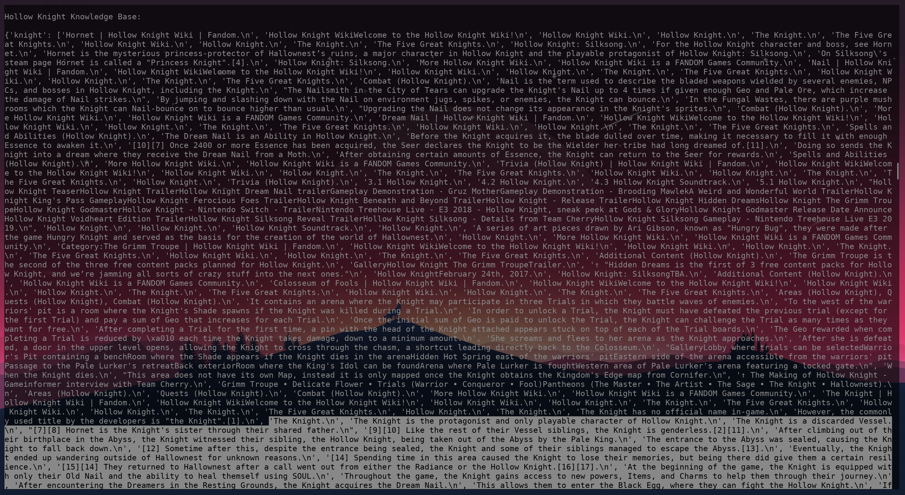

# Knowledge Base

The way I built the knowledge base was a pretty simple method but covered all of the pertinant data required for training a bot. To determine the frequencies of the key terms, I simply used a term frequency algorithm to see which words are used the most. Due to the relatively narrow field and limited information sources, the use of more complex frequency algorithms would be overkill for this situation. After generating the frequencies of terms, I selected the top 10:

```python
top_ten = ['knight', 'hollow', 'nail', 'dream', 'map', 'essence', 'soul', 'hallownest', 'enemies', 'void']
```

Using these words, I looped through a list of ALL sentences that were scraped from the web crawler section and found all sentences that contained the repective key term. These sentences were then stored in a list as the values of the knowledge base dictionary. In the screenshot below, it shows the first entry of the knowledge base with the 'knight' keyword:



I then pickled this dictionary into a file to be used later.

# Sample Dialog Flow

**User**: Who is the Hollow Knight?

**HollowBot**: The Knight is the protagonist and only playable character of Hollow Knight.

**User**: What is the dream nail?

**HollowBot**: The Dream Nail is an Ability in Hollow Knight. It can collect Essence and enter dreams. The Dream Nail is a sacred weapon and talisman, which can cut the veil that separates the waking world from dreams.

**User**: What is the void?

**HollowBot**:  At the end of the fight, the Hollow Knight returns as a Shade that rips open the Radiance's face, allowing the Knight to lash at her until she is eventually dragged into the Void and banished. The void lies at the bottom of the world and is the essence of the Knight.